# LLM Wiki — a Claude plugin for an AI-maintained second brain

Point Claude at a folder. It builds a knowledge base out of your sources — plain markdown, interlinked, cited, and kept current — and maintains it for you. You curate the sources, ask the questions, and decide what matters.

Built for **Claude Cowork** (and works in Claude Code). Obsidian is the nice front end; nothing depends on it — Claude follows the wiki's links itself, and any editor can open the vault.

By **Dr. Markus Wuebben** ([github.com/mhwuebben](https://github.com/mhwuebben) · markus.wuebben@gmail.com), inspired by Andrej Karpathy's [LLM Wiki proposal](https://gist.github.com/karpathy/442a6bf555914893e9891c11519de94f).

## What's in the plugin

**Thirteen skills.** Claude picks them up automatically when the task fits; you can also invoke one by name, or with `/` in Cowork and Claude Code.

An item you add is **pending** while it sits in `raw/inbox/`, and **ingested** once it has moved out of the inbox and a source page points at it.

**Several vaults?** Each is a *part* of one brain. Questions read across all the parts a session can reach, routed by what each vault's schema says it is for, and scoped exactly when you name one ("ask the research vault"). A project that combines several wikis is a reading room: the only thing it writes is a capture into one part's inbox, which that part's own project then ingests. Ingest, lint, maintain, dream passes and upgrades refuse there and say which part's project to use, because each works on a vault as a whole and a combined project has no one vault it belongs to. wiki-doctor, wiki-status and wiki-gaps still run. A `[[link]]` only resolves inside one folder, so a claim borrowed from another part is quoted with that part's name and id instead of linked. With one vault connected, none of this is visible. For one question that matters and sits across parts, ask for a **delphi** pass: each part answers alone, then sees the others' quoted claims — not their conclusions — and says what it contradicts, confirms independently or can now add; the answer separates what they agree on, what they disagree on and why, what only one part knows, and what none of them does.

The plugin has an eval suite: `claude plugin eval .` runs fourteen cases — ten that a message reaches the right skill, four that a skill does the right thing to a fixture vault. `evals/README.md` says how to run them and what each asserts.

Every skill also has a **debug mode**, off unless the schema's §11 `Debug:` line says otherwise or you ask for it: a run then records, alongside its normal work, wherever the plugin's own instructions made it guess — versioned, quoted, and reproducible without your vault, in `outputs/debug-YYYY-MM-DD.md`. It is the fastest way to send back a bug in a plugin written in prose.

Getting sources in:

| Skill | What it does | When, and how |
|---|---|---|
| `wiki-capture-only` | Gets a source into `raw/inbox/` cleanly — URLs, PDFs, transcripts, screenshots, pasted notes — with provenance, after checking it is in scope, complete and not already there. Stops there: the item is pending. Also imports whole existing folders, keeps a backlog while the vault is out of reach, and sets up the Obsidian Web Clipper. | When you want to keep something for later without processing it now. Manual. |
| `wiki-capture-and-ingest` | Captures one or more new items, then ingests exactly those; anything else in the inbox stays pending. | Whenever you hand over a link or a file you want in the wiki now — the everyday route. Manual; the project instructions route a dropped link here. |
| `wiki-ingest-pending` | The core loop. Takes pending items — the ones you name, or everything in `raw/inbox/`, including clips and drops that arrived without Claude — and for each one reads it, writes its page, propagates the change across every affected page, checks that every page the source names really cites it, flags contradictions and moves the file out of the inbox. | When items are waiting: clips, drops, things you saved for later. Manual ("process what's waiting"), and inside `wiki-capture-and-ingest` and `wiki-maintain`. |
| `wiki-maintain` | The routine: bring in what is on the offline backlog and what changed in imported folders, ingest everything pending, lint (only the mechanical fixes on its own), and write a digest of what the wiki learned since the last run. Built to run unattended. | Weekly for an active vault, monthly for a quiet one. **Scheduled**, or by hand after a busy stretch. |

Using and looking after the wiki:

| Skill | What it does | When, and how |
|---|---|---|
| `wiki-query` | Answers from the compiled wiki with citations — following links in both directions, by name, in any folder — names the gaps, and files good answers back as notes. An answer turned into a deck, document or chart is filed as a note first, so the thinking outlives the file. | Whenever you ask. Manual; the project instructions route questions here. |
| `wiki-lint` | Fourteen health checks — including clips nobody ingested, sources that should never have been filed, and a sample of citations tested against the sources they cite — fixes on approval, plus the gaps worth researching next. Repairs; it doesn't synthesise. | Scheduled, inside every `wiki-maintain` run; manual on its own after a big batch or when the wiki feels messy. |
| `wiki-dream` | Consolidation, in one sitting: runs `wiki-dream-only`, then `wiki-dream-ingest` on the report it just wrote. | When you want new connections and are there to decide. Manual. |
| `wiki-dream-only` | Reads across what's already filed for connections no page states yet — bridges between subjects, questions the vault can now answer, sources that agree independently, pages that should link — and writes each as a cited, inference-marked proposal to a report. Applies nothing; adds nothing from outside the vault. Each pass leaves a short register of open hypotheses in the log — a loop seen twice, a connection one line short — which the next pass tests first. | After about ten new sources, which is what makes a pass worth running; the digest says when it's due. **Scheduled**, or manual. |
| `wiki-dream-ingest` | Works through a dream report with you: re-checks each finding against the wiki as it is now, puts it to you, files what you accept as notes, links and citations, and remembers what you rejected. | After a dream pass — the digest, the task's notification and `wiki-status` say a report is waiting. Manual; it needs you. |
| `wiki-status` | Where the wiki stands: size, what's pending, what's running, imported folders, what changed, what it still doesn't know — plus what is waiting for your decision. Read-only. | Any time. Manual. |
| `wiki-doctor` | Whether the machinery is sound: the vault's structure and scripts, the schema against the plugin version that built it, the project instructions, the scheduled tasks and their prompts, whether the folder is attached to them, and whether the routines have actually run. Reports problems with the text to paste for each fix. Read-only. | After a plugin update, when a scheduled run stops happening, when something is off. Manual. |
| `wiki-gaps` | What's missing and what to go and read. Read-only. | When deciding what to read next. Manual. |
| `wiki-setup` | Builds the vault: `raw/`, `wiki/`, `_meta/schema.md`, index, overview, log, templates. Interviews you first so the schema fits your domain, and hands you the project instructions to paste into your project, together with the scheduled-task prompt. Later, upgrades an existing vault after a plugin update. | Once per vault; again after an update. Manual. |

**Two sub-agents:**

- `wiki-reader` — reads one source in parallel when several are ingested at once, and drafts its page. Writes nothing else, so parallel readers can't clobber each other.
- `wiki-auditor` — audits a slice of the vault read-only during a lint pass and returns findings.

No hooks and no MCP servers: everything here is instructions and markdown, so there's nothing to trust beyond the files you can read.

### What makes it safe to leave running

- **One writer at a time.** Every skill that changes the wiki first takes the vault lock, `_meta/wiki-lock.md`: a lease with a holder, an expiry and a line per step, so you can open it and see what is running. A second session waits; a session that died is taken over a minute after its lease runs out — normally within six minutes — and the next ingest finishes whatever it left half done. Reading, capturing and writing reports never wait.
- **You can see what it is doing.** A long run — an import, a batch, the routine — starts with a plan (how many items, how many passes, how long), says what it is about to do before each long step, and reports a tally after each pass. The lock file shows the same count at any moment.
- **Nothing gets lost while the folder is out of reach.** If Claude can't reach the vault — a cloud session with your laptop closed, a chat from your phone — a link or note you send goes on a backlog in the Claude project (`wiki-backlog.md`). The next session that can reach the folder captures it before anything else, and so does the scheduled `wiki-maintain` run.

## Install

### In Cowork, from the marketplace (best for sharing)

1. In Claude Desktop, open the **Cowork** tab → **Customize** → **Plugins** → **+** → **Add marketplace**.
2. Paste `mhwuebben/llm-wiki` (or the full URL) and sync.
3. Find **llm-wiki** in the listing and install it.

Updates arrive on the next sync, which is why this beats sending files around. See *Upgrading* below for what a sync does not change.

### In Cowork, from the file

**Customize → Plugins → +** and upload the plugin folder (zipped). Same components, no update channel.

### In Claude Code

```
/plugin marketplace add mhwuebben/llm-wiki
/plugin install llm-wiki@mhwuebben-plugins
```

### Forking it

Push your copy to a git repo whose root contains `.claude-plugin/marketplace.json` — it already does — then add that repo as a marketplace.

Change authorship where it appears: `author` and `repository` in `.claude-plugin/plugin.json`; `owner` and `name` in `.claude-plugin/marketplace.json` (and the install commands above, which use that name); `skills/wiki-setup/assets/about.md`, the introduction and sign-off `wiki-setup` shows; and this README's byline and contact lines. Keep the copyright line in `LICENSE`, as the MIT licence requires, and add your own beside it.

### Upgrading

A sync updates the skills. It does not touch anything in your vault:

- **Your `_meta/schema.md` stays as it was.** It is yours, and the skills follow it over their own defaults — lint included, so a schema you have customised never floods a report. When a release changes a schema convention, ask Claude to *upgrade the vault*: `wiki-setup` compares your schema with the current template and proposes each change for you to approve, brings existing pages in line with what changed, and offers subfolders for any folder that has grown large.
- **Your project instructions stay as they were.** When a release changes routing, re-paste them: ask Claude to *upgrade the vault*, which shows the current text, or copy the first fenced block from `skills/wiki-setup/assets/project-instructions.md`.
- **Scheduled tasks name skills.** If a task's prompt names a skill this plugin doesn't have, ask Claude to *upgrade the vault*: it gives you the current prompt. The plugin can't edit a task for you.

## First run

1. Make a folder for the vault (or pick one that already has documents in it).
2. In Cowork, click **Work in a project or folder** and choose it.
3. Say: *"Set up an LLM wiki here — it's for [your topic]."*
4. Answer setup's questions — two short cards, and one about the schedule near the end.
5. Open the folder in Obsidian (**Open folder as vault**) and look at the graph. Optional — any editor works.
6. Set up the Web Clipper when setup offers it — setup shows you the template to import — clip one article, then run `wiki-ingest-pending`. Watch the pages appear.

Then make it a Cowork **project** — create one and add this folder to it. At the end, `wiki-setup` hands you two things together (both also live at `skills/wiki-setup/assets/project-instructions.md`):

- **The project instructions**, to paste into the project. They make later sessions answer from the wiki instead of from general knowledge, ingest a dropped link instead of parking it, and keep a backlog when the folder is out of reach.
- **The scheduled task prompt**, for a recurring task on the project that runs `wiki-maintain` — weekly suits an active vault. Set the task to approve automatically, or it stops at its first file write; attach the vault folder to the task itself, and run it on the computer that holds the folder:

  ```
  Run the wiki-maintain skill on the LLM wiki in the folder connected to this task: the one whose _meta/schema.md carries the vault id <ID> (the folder was called "<FOLDER>" when this task was set up; the id, not the name, identifies it). If no connected folder carries that id but exactly one holds a _meta/schema.md, use it and say so in the digest. This is an unattended scheduled run: don't wait for answers; put anything that needs a decision in the digest.
  ```

  Naming the folder is a hint, not the locator, so renaming the vault costs a line in the prompt rather than a failed run — but a task with no folder attached can do nothing at all.

Once there are ten or so sources, add a monthly `wiki-dream-only` pass the same way; you work through its reports with `wiki-dream-ingest`.

## Feeding the vault

Most sources should arrive without asking Claude. The **Obsidian Web Clipper** is the main path: `wiki-setup` gives you a template to import (`skills/wiki-setup/assets/webclipper-template.json`, also saved to your vault as `_meta/webclipper-template.json`) that clips articles straight into `raw/inbox/` with the provenance fields the wiki expects — and because it runs in your logged-in browser, it gets paywalled and JavaScript-heavy pages a server-side fetch can't.

Drag-and-drop, phone sync, and read-later exports work the same way. The wiki doesn't care how a file arrived:

- `raw/` is immutable, including files other tools wrote — clips are never reformatted, and frontmatter is mapped onto the source page rather than rewritten in place.
- Ingest splits a source by kind: text to `raw/`, binaries to `raw/assets/` with a provenance sidecar left in `raw/`. Attachments — images in a clip, figures from a paper — go to `raw/assets/` too, but belong to their parent and get no sidecar. So `raw/` is always greppable, `raw/assets/` holds the originals, and a source page carries `raw:` for the markdown and `asset:` as a list of everything it owns in `raw/assets/`.
- A source counts as ingested when a source page points at its file, not because of a flag — so nothing gets filed twice and nothing gets silently skipped.
- Every arrival passes the same scope test before it is ingested, however it got there. Admin (tickets, invoices, statements, credentials) and other people's personal data (CVs, private threads, contact files) stay in the inbox until you decide.
- The lint pass checks `raw/` against the source pages and reports clips nobody ingested.

Clip freely; ingest the same day with `wiki-ingest-pending`, and let the scheduled `wiki-maintain` run sweep up whatever is left.

**Bringing in a folder you already have** — a docs repository, a Notion or Evernote export, course materials, a shared drive — is an import, not a copy. Claude first says how many files there are, what it would leave out (build output, generated reference material) and roughly how many passes the ingest will take, and suggests starting with one part. It copies each file under a unique name built from its path, so the `README.md` in every subfolder doesn't clash. An import record in `_meta/imports/` keeps where each copy came from, a fingerprint of its content and, in a git repository, the date of its last change. That lets source pages carry their `origin:` and date, lets the folder's own structure become subjects, and lets every scheduled `wiki-maintain` run bring in what changed in the folder since.

## What lands in the folder

```
vault/
├── README.md            how this vault works, for you
├── index.md             catalog of every page — read first on every question
├── overview.md          the evolving synthesis: what we know, open questions, contradictions
├── patterns.md          personal vaults only: loops the sources keep showing
├── _meta/
│   ├── schema.md        the conventions Claude follows — yours to edit
│   ├── log.md           one entry per operation, append-only
│   ├── imports/         a record of every folder imported whole: where each copy came from
│   ├── wiki-lock.md     the vault lock: free, or what is writing right now
│   ├── wiki-lock.sh     the script that takes and releases it
│   ├── wiki-search.sh   the searches the skills run — backlinks, citations, pending
│   ├── moves/           a record of every reorganisation, if pages were ever moved
│   ├── webclipper-template.json  the Web Clipper template, to import
│   └── templates/       page templates for source, entity, concept, note
├── raw/                 your sources, one markdown file each — immutable
│   ├── inbox/           pending items, waiting to be ingested
│   └── assets/          binary originals and attachments — immutable
├── wiki/                Claude's pages, all regenerable from raw/ + the schema
│   ├── sources/         one page per source — once large, optionally in year or subject subfolders
│   ├── entities/        people, organisations, products, places, datasets
│   ├── concepts/        ideas, methods, mechanisms, themes
│   └── notes/           filed answers, the thinking behind decks and documents, approved dream findings
└── outputs/             decks, exports, charts, lint reports, digests, dream and debug reports
```

`_meta/schema.md` is the file worth reading and editing. It's what makes Claude a disciplined wiki maintainer rather than a chatbot with file access, and it's meant to evolve as you learn what your domain needs.

### Where things go, and when

| Path | What lands there | When, and who puts it there |
|---|---|---|
| `raw/inbox/` | Every new source, whatever its type: a Web Clipper article, a dropped PDF, a synced file, a URL Claude fetched and converted to markdown, a pasted note. A binary Claude captures gets a markdown sidecar with the same name stem, holding its provenance; one that arrived on its own gets its sidecar at ingest. | The moment it arrives — from you, your tools, `wiki-capture-only` or `wiki-capture-and-ingest`. It is pending here until it is ingested. A file that fails the scope test (admin, or another person's personal data) stays here until you decide. |
| `raw/` | One markdown file per capture of an ingested source. Text sources as they came; for a binary, its sidecar — what it is, where it came from, when it was captured, how complete the capture is. No extracted text. A changed source captured again gets a new file; its page points at the newest, keeps the last ten under `raw_previous:`, and lists every capture it ever had — with what changed and why — under `## Version history`. | At ingest, moved out of the inbox once the source's pages are written. Never edited, renamed or deleted afterwards; the one permitted touch is flipping an existing `ingested:` flag. |
| `raw/assets/` | The binary originals — PDFs, Word files, slides, images, audio, video, spreadsheets — plus attachments: figures pulled from a paper, images inside a clip, files attached to an email. Attachments are named after their parent's file and get no sidecar. | At ingest, while its sidecar moves to `raw/`. Images you paste or download in Obsidian land here directly, once you point Obsidian's attachment folder here during setup; ingest lists them on their parent. |
| `wiki/sources/` | One page per source: summary, key claims, the entities and concepts it touches, how it sits with the rest of the wiki, open questions. Its `raw:` field points at the file in `raw/`, `asset:` lists what it owns in `raw/assets/`. | At ingest — `wiki-ingest-pending`, run by you, by `wiki-capture-and-ingest` or by `wiki-maintain`. After a duplicate check, so nothing gets two pages. |
| Subfolders of a type folder | `wiki/sources/2026/`, `wiki/concepts/pricing/` — only where the schema groups that type (§3), by year or by subject. One level deep. | A page lands in its subfolder when it is created. A grouping is set at setup only when it's known in advance (a journal by year, a course by module); otherwise lint proposes one once a folder passes ~100 pages. A subject can name its own page in the wiki (a project, a module, a book) in schema §3c; each new source gets its subject from §3c's line, or else from the subjects of the sources it shares pages with, and the ingest report says which. Pages are moved only with you present, recorded in `_meta/moves/`, and a page you move stays where you put it. |
| `wiki/entities/`, `wiki/concepts/` | What the vault knows about each thing, gathered across every source that mentions it, each claim with its source link and disagreements shown on the page. | Created at ingest once a thing clears the schema's promotion bar — a second source, enough said that someone would search for it by name, or two pages already linking to it. Until then it's a line on the nearest page. Updated by every later source that touches it. |
| `wiki/notes/` | Answers worth keeping, the argument behind a deck or briefing, and connections across pages you approved. | `wiki-query` files a good answer — and, when an answer becomes a deck or document, files the synthesis here *before* making it; `wiki-dream-ingest` adds a dream finding you accepted, marked as inference. |
| `index.md`, `overview.md` | The catalog, and the current best picture — including open questions, contradictions in play and what to read next. | The index gains a row for every new page, at ingest or when a note is filed; lint rebuilds it from the pages whenever it has drifted. The overview is revised whenever an ingest, a filed answer or an approved finding moves the picture. |
| `patterns.md` | Recurring loops in how you work, decide or get stuck — each with the sources that show it. Claude's reading of them is kept apart, marked as inference. | Personal vaults only. A loop earns a line at the third source that shows it — added at ingest or proposed by a dream pass. |
| `_meta/imports/` | One record per imported folder: each file's path in that folder, a fingerprint, its git date, and the name of its copy. | Written when a folder is imported; extended by every sync, when `wiki-maintain` brings in what changed. |
| `_meta/wiki-lock.md`, `_meta/wiki-lock.sh` | The vault lock: free, or which operation is writing right now, with a line per step — and the small script every writing skill takes and releases it with. | Created at setup. Taken and released by every skill that changes the wiki; open the `.md` any time to see what is running. |
| `_meta/wiki-search.sh` | The searches the skills run — where a name resolves to, what links a page, whether a page's body cites a source, what is waiting in the inbox. One command each, so ingest, query and lint always get the same answer. | Created at setup. Run by the skills; run it yourself any time — `sh _meta/wiki-search.sh backlinks <page>`. |
| `_meta/log.md` | One entry per operation: setup, capture, ingest, query, lint, maintain, dream, schema — including, by topic, questions the wiki couldn't answer. | Appended by every skill that changes something. It's how `wiki-maintain` knows what's new since last time, how a dream pass knows what you've already rejected, and how `wiki-gaps` knows what you keep asking about. |
| `outputs/` | Decks, exports and charts, plus the routine reports: `lint-YYYY-MM-DD.md`, `digest-YYYY-MM-DD.md`, `dream-YYYY-MM-DD.md`, and `debug-YYYY-MM-DD.md` where debug mode is on. | `wiki-query` when an answer becomes a deck, document or chart; `wiki-lint`, `wiki-maintain` and `wiki-dream-only`, each time they run. |

### Why it's split this way

- **`raw/` is the ground truth.** Everything in `wiki/` can be rebuilt from `raw/` and the schema; nothing can rebuild `raw/`. That is why it is never edited, and why a claim on a wiki page always links back to a source.
- **Text in `raw/`, binaries in `raw/assets/`.** `raw/` stays one greppable markdown file per capture, while the originals sit beside it and get reopened whenever a claim needs checking.
- **One queue.** Every source enters through `raw/inbox/` (only images Obsidian downloads into `raw/assets/` skip it), so `wiki-ingest-pending`, `wiki-maintain` and lint all look in one place — nothing gets filed twice, nothing silently skipped.
- **"Ingested" is derived, not flagged.** A source counts as ingested when a source page points at its file. Files from other tools often carry no flag, and a flag can be wrong; the pointer can be checked.
- **`outputs/` is disposable.** A deck or report is a view of the wiki, never the only copy of a thought, so lint never reads it and clearing it loses nothing but renders. Three catches: a dream report still awaiting review is the only copy of its findings, a debug file nobody has read yet is the only copy of what a run found confusing in the plugin, and a chart embedded in a note shows as a broken embed until it is made again from the note.
- **Names for links, folders for you.** Every page name is unique across the vault and links use names, not paths. So Claude finds any page wherever it sits, you can reorganise inside `wiki/` in any editor, and nothing depends on Obsidian: outside it, a `[[link]]` isn't clickable, but searching for the file by name finds exactly one.
- **The schema is yours.** Plugin updates never change `_meta/schema.md`; the skills follow it over their own defaults.

### How an item moves through the wiki

Blue boxes are the skills you run, or that run each other; amber is where an item starts; green are the states it passes through; yellow diamonds are the checks; red is where it stops; dashed boxes with italic text are comments.

```mermaid
%%{init: {"flowchart": {"nodeSpacing": 30, "rankSpacing": 45, "curve": "basis"}, "themeVariables": {"fontSize": "15px"}}}%%
flowchart LR
  %% ── where an item comes from ──────────────────────────────
  U(["You hand over a link, a file,<br/>a pasted text or a screenshot"]):::you
  A(["It arrives on its own<br/>Web Clipper · drag-and-drop<br/>· an imported folder, synced"]):::you

  U --> R{"Vault folder<br/>reachable?"}:::check
  R -- "no" --> BL[("BACKLOG<br/>wiki-backlog.md<br/>in the Claude project")]:::state
  BL -. "drained first by the next session<br/>that reaches the folder, and by wiki-maintain" .-> W
  R -- "yes" --> W{"Which wiki?<br/>only when several<br/>are connected"}:::check
  W --> CAP[["wiki-capture-only"]]:::cmd
  N4["Several wikis connected:<br/>capture only — the item waits<br/>in that wiki's inbox for its<br/>own project to ingest it"]:::note
  N4 -.- W
  CAP --> G1{"In scope?<br/>Complete?<br/>Not already in?"}:::check
  G1 -- "no" --> X["Not captured<br/>you are told why"]:::stop
  G1 -- "yes" --> P[("PENDING<br/>raw/inbox/")]:::state
  A --> P

  %% ── ingest ────────────────────────────────────────────────
  P --> ING[["wiki-ingest-pending"]]:::cmd
  ING --> C{"Already in?<br/>In scope?"}:::check
  C -- "out of scope" --> H["Stays pending<br/>until you decide"]:::stop
  C -- "unchanged copy" --> K["Skipped"]:::stop
  C -- "a newer version" --> RC["Re-capture<br/>diff against the previous copy<br/>+ a Version history line"]:::step
  C -- "new" --> INGEST
  RC --> INGEST

  subgraph INGEST["ingest — steps 3 to 5b write under the vault lock"]
    direction TB
    S1["1 · Read<br/>in full"]:::step --> S2["2 · Check in<br/>unless the schema says<br/>file first"]:::step --> S3["3 · Source page<br/>wiki/sources/"]:::step --> S4["4 · Propagate<br/>entities · concepts · overview<br/>contradictions flagged<br/>then close the list"]:::step --> S5["5 · Move out of the inbox<br/>text → raw/<br/>binary → raw/assets/<br/>index + log"]:::step --> S5b["5b · Verify<br/>no orphans · index in line<br/>frontmatter complete"]:::step
  end

  INGEST --> D[("INGESTED")]:::done
  D --> AFTER[["wiki-maintain<br/>wiki-dream<br/>wiki-query"]]:::cmd

  %% ── comments ──────────────────────────────────────────────
  N1["wiki-capture-and-ingest runs<br/>wiki-capture-only, then<br/>wiki-ingest-pending on just<br/>the items it captured"]:::note
  N1 -.- CAP
  N2["Called by<br/>• wiki-capture-and-ingest:<br/>the new items<br/>• you: the items you name,<br/>or everything<br/>• wiki-maintain: everything,<br/>on schedule<br/><br/>Several at once:<br/>one closing check per pass,<br/>nothing leaves the inbox<br/>before it has passed"]:::note
  N2 -.- ING
  N3["From then on it is linted and<br/>summed up in the digest,<br/>connected by dream passes,<br/>and cited in answers<br/><br/>Several wikis connected:<br/>answers read across them,<br/>delphi on request"]:::note
  N3 -.- AFTER

  %% ── legend ────────────────────────────────────────────────
  subgraph LEGEND["legend"]
    direction LR
    L1[["command — a skill"]]:::cmd ~~~ L2[("state of an item")]:::state ~~~ L3{"check"}:::check ~~~ L4["ingest step"]:::step ~~~ L5["stops here"]:::stop ~~~ L6["comment"]:::note
  end

  classDef cmd fill:#1d4ed8,stroke:#1e3a8a,stroke-width:2px,color:#ffffff,font-weight:bold
  classDef you fill:#fef3c7,stroke:#b45309,color:#78350f
  classDef state fill:#dcfce7,stroke:#15803d,stroke-width:2px,color:#14532d,font-weight:bold
  classDef done fill:#15803d,stroke:#14532d,stroke-width:2px,color:#ffffff,font-weight:bold
  classDef check fill:#fef9c3,stroke:#a16207,color:#713f12
  classDef step fill:#f1f5f9,stroke:#64748b,color:#0f172a
  classDef stop fill:#fee2e2,stroke:#b91c1c,color:#7f1d1d
  classDef note fill:#ffffff,stroke:#94a3b8,stroke-dasharray:4 3,color:#475569,font-style:italic
  style INGEST fill:#f8fafc,stroke:#1d4ed8,stroke-width:1px,stroke-dasharray:6 4,color:#1e3a8a
  style LEGEND fill:#ffffff,stroke:#cbd5e1,color:#475569
```



### One source, end to end

A PDF you hand Claude on 20 September:

1. **Checked:** `wiki-capture-and-ingest` runs `wiki-capture-only`, which checks it is in scope and not already in the vault.
2. **Arrives:** it lands as `raw/inbox/2026-09-20-attention.pdf`, with the provenance sidecar `raw/inbox/2026-09-20-attention.md` beside it — complete, page count recorded — and is logged as `capture | Attention Is All You Need`. It is pending; `wiki-capture-and-ingest` hands just this item to `wiki-ingest-pending`.
3. **Read and filed:** `wiki/sources/attention-is-all-you-need.md`, with `raw: raw/2026-09-20-attention.md` and `asset: [raw/assets/2026-09-20-attention.pdf]`.
4. **Propagated:** new pages for `transformers` and `self-attention`, updates to every page it confirms or refines, a contradiction callout wherever it disagrees with an earlier source, a revised `overview.md` — and a closing check that every page the source page lists cites it.
5. **Moved and indexed:** the PDF to `raw/assets/`, the sidecar to `raw/`, new rows in `index.md`. It is no longer pending; anything else in the inbox still is.
6. **Logged:** `## [2026-09-20] ingest | Attention Is All You Need` in `_meta/log.md`, after the capture entry.

A web clip goes the same way, minus the sidecar: the clip itself moves to `raw/`, and any images Obsidian downloaded for it — already in `raw/assets/` — are listed on its source page's `asset:`. A PDF you drop into the inbox yourself also goes the same way; ingest writes its sidecar.

## Habits that make it work

- **Ingest the same day you capture.** An inbox that grows without being processed is the failure mode this pattern exists to avoid.
- **Stay in the loop early.** Review the first ten source pages; your corrections become conventions in the schema.
- **File your good answers.** A question answered in chat and nowhere else taught the wiki nothing.
- **Let it maintain itself on a schedule.** Duplicates and stale claims compound as fast as the knowledge does; `wiki-maintain` ingests, lints and tells you what changed in one pass.
- **Let it dream, then judge.** A monthly dream pass finds connections nobody asked for. Everything it proposes is inference — go through the report with `wiki-dream-ingest`, accept the ones that hold up side by side, reject the rest, and the rejections stop it proposing them again.
- **Let the schema change.** When you keep correcting the same thing, fix it in the schema instead.

## Editing it

Every component is markdown. Change a `SKILL.md` and it takes effect in the current session; agents need a plugin reload or a new session. Bump `version` in both manifests when you publish a change, or marketplace installs won't pick it up.

## Credit and contact

The plugin is inspired by Andrej Karpathy's [LLM Wiki proposal](https://gist.github.com/karpathy/442a6bf555914893e9891c11519de94f) (April 2026): immutable raw sources, an LLM-owned wiki, a schema you and the model co-evolve, and the ingest / query / lint loop. It builds on that proposal for Cowork, with the Obsidian conventions, page templates, propagation rules and maintenance checks filled in.

Written and maintained by **Dr. Markus Wuebben** — [github.com/mhwuebben](https://github.com/mhwuebben). Questions, ideas or something not working: markus.wuebben@gmail.com, or [open an issue](https://github.com/mhwuebben/llm-wiki/issues).
